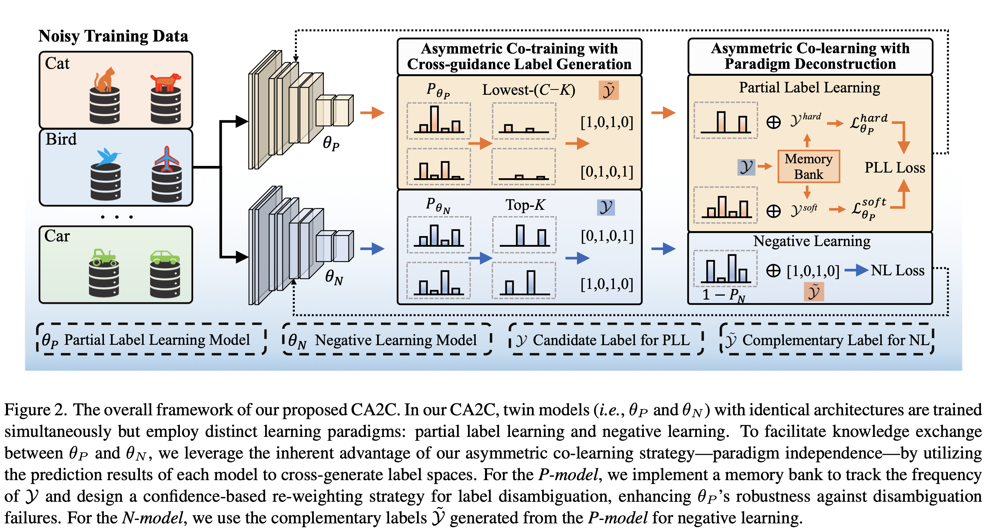
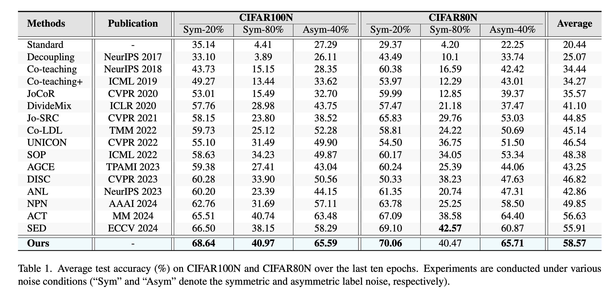
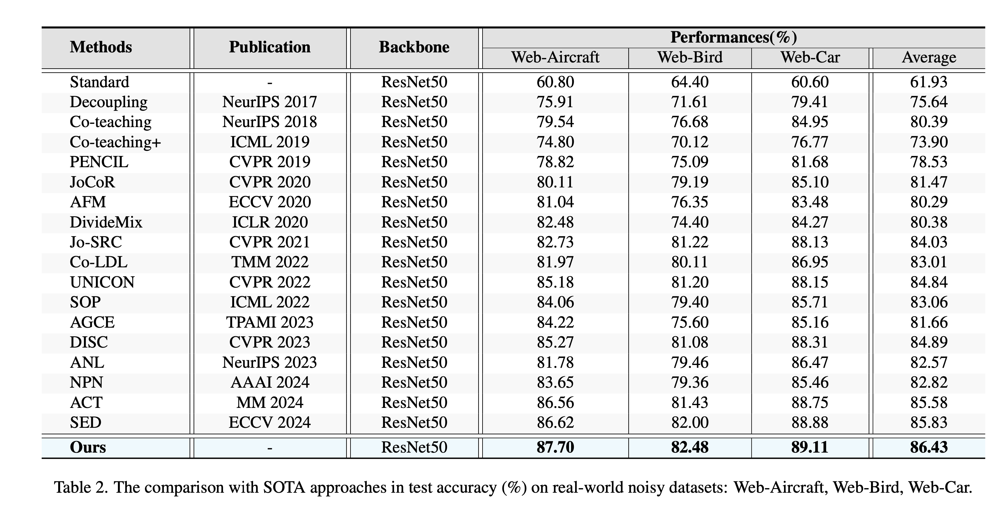

# CA2C: A Prior-Knowledge-Free Approach for Robust Label Noise Learning via Asymmetric Co-learning and Co-training
**Abstract:** Label noise learning (LNL), a practical challenge in real-world applications, has recently attracted significant attention. While demonstrating promising effectiveness, existing LNL approaches typically rely on various forms of prior knowledge, such as noise rates or thresholds, to sustain performance. This dependence limits their adaptability and practicality in real-world scenarios where such priors are usually unavailable. To this end, we propose a novel LNL approach, termed CA2C (Combined Asymmetric Co-learning and Co-training), which alleviates the reliance on prior knowledge through an integration of complementary learning paradigms. Specifically, we first introduce an asymmetric co-learning strategy with paradigm deconstruction. This strategy trains two models simultaneously under distinct learning paradigms, harnessing their complementary strengths to enhance robustness against noisy labels. Then, we propose an asymmetric co-training strategy with cross-guidance label generation, wherein knowledge exchange is facilitated between the twin models to mitigate error accumulation. Moreover, we design a confidence-based re-weighting approach for label disambiguation, enhancing robustness against potential disambiguation failures. Extensive experiments on synthetic and real-world noisy datasets demonstrate the effectiveness and superiority of CA2C.

# Pipeline



# Installation
```
pip install -r requirements.txt
```

# Datasets
We conduct noise robustness experiments on a synthetically corrupted dataset (i.e., CIFAR100N) and three real-world datasets (i.e., Web-Aircraft, Web-Car and Web-Bird).
Specifically, we create the noisy dataset CIFAR100N based on CIFAR100.
We adopt two classic noise structures: symmetric and asymmetric, with a noise ratio $n \in (0,1)$.

You can download the CIFAR10 and CIFAR100 on [this](https://www.cs.toronto.edu/~kriz/cifar.html).

You can download Web-Aircraft, Web-Car, and Web-Bird from [here](https://github.com/NUST-Machine-Intelligence-Laboratory/weblyFG-dataset).

# Training

An example shell script to run CA2C on CIFAR100N :

```python
python main.py --gpu 7 --noise-type asymmetric --closeset-ratio 0.4 --dataset cifar100nc --method CA2C 
```

# Results on CIFAR100N and CIFAR80N:




# Results on Web-Aircraft, Web-Bird, and Web-Car:



# Results on Food101N:


# Effect of main modules in test accuracy (%) on CIFAR100N and CIFAR80N:


